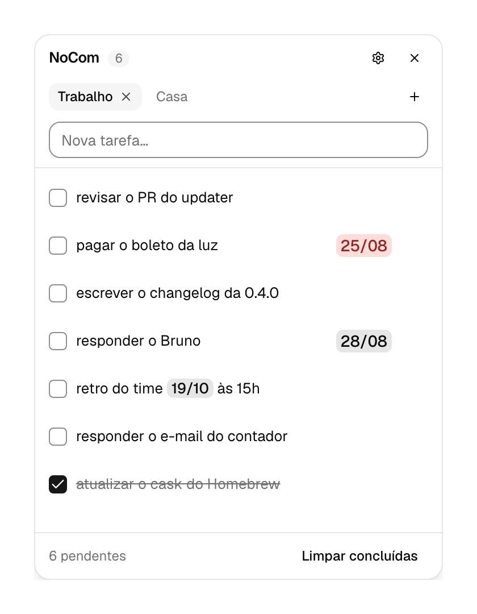

<div align="center">


# NoCom

**Uma lista de tarefas que vive por cima do seu trabalho.**

Aparece com um atalho de teclado, some com `Escape`, e guarda tudo no seu
computador. Sem conta, sem nuvem, sem sincronização.

**Português** · [English](README.en.md)

[](https://github.com/Zheonatan/nocom/releases/latest)
[](https://github.com/Zheonatan/nocom/actions/workflows/ci.yml)
[](LICENSE)
[](https://ko-fi.com/zheos)

<!-- Duas fotos da mesma janela, uma por tema, e o GitHub escolhe pela
     `prefers-color-scheme` de quem está lendo -- o app segue o tema do sistema, e
     uma foto clara num README escuro anunciaria um app que ele não é. O PNG tem
     fundo transparente, então o canto arredondado da janela assenta nos dois. -->
<picture>
  <source media="(prefers-color-scheme: dark)" srcset="assets/telas/janela-escura.png">
  
</picture>

</div>

---

## O problema

Você está no meio de outra coisa — código, planilha, reunião — e lembra de uma
tarefa. Anotar não deveria custar trocar de aplicativo, esperar carregamento e
perder o fio da meada.

O NoCom existe para esse instante. O ciclo completo é:

```
⌃⌥T  →  digitar  →  Enter  →  ⌃⌥T
```

Dois segundos, a mão nunca sai do teclado.

## Baixar

### macOS — pelo Homebrew (recomendado)

```sh
brew tap Zheonatan/tap
brew trust --cask Zheonatan/tap/nocom
brew install --cask nocom
```

Atualizar depois é só `brew upgrade --cask nocom`.

**Uma ressalva antes de instalar:** o `brew` carimba quarentena em tudo que
instala, então na primeira abertura o macOS vai bloquear o NoCom e oferecer
"Mover para o Lixo". Não clique nesse botão — a explicação e o comando de uma
linha que resolve estão em
[Primeira execução](#primeira-execução-o-aviso-do-sistema).

**Por que o `brew trust`?** Sem ele o `brew` recusa a instalação com
*"Refusing to load cask from untrusted tap"*. Não é sinal de problema com o
NoCom: desde o Homebrew 6 qualquer repositório que não seja oficial exige que
você diga explicitamente que confia nele, uma vez, antes do primeiro uso. O
comando acima confia **apenas neste cask** — nada mais que eu publicar no tap
entra de carona.

### Windows — pelo winget (recomendado)

```sh
winget install Zheonatan.NoCom
```

Atualizar depois é só `winget upgrade Zheonatan.NoCom`.

**Por aqui o SmartScreen não aparece.** O aviso *"o Windows protegeu seu PC"* vem
de uma marca que o **navegador** carimba em todo arquivo baixado; o winget baixa
e executa o instalador por fora do navegador, conferindo o `sha256` publicado no
manifesto. Baixando o `.exe` na mão o aviso continua — e a causa é a mesma de
sempre: o instalador ainda não é assinado. Veja
[Primeira execução](#primeira-execução-o-aviso-do-sistema).

### Download direto

| Sistema | Arquivo |
| --- | --- |
| **macOS** (Apple Silicon) | [NoCom_0.5.0_aarch64.dmg](https://github.com/Zheonatan/nocom/releases/download/v0.5.0/NoCom_0.5.0_aarch64.dmg) |
| **macOS** (Intel) | [NoCom_0.5.0_x64.dmg](https://github.com/Zheonatan/nocom/releases/download/v0.5.0/NoCom_0.5.0_x64.dmg) |
| **Windows** | [NoCom_0.5.0_x64-setup.exe](https://github.com/Zheonatan/nocom/releases/download/v0.5.0/NoCom_0.5.0_x64-setup.exe) |
| **Linux** (.deb) | [NoCom_0.5.0_amd64.deb](https://github.com/Zheonatan/nocom/releases/download/v0.5.0/NoCom_0.5.0_amd64.deb) |
| **Linux** (.rpm) | [NoCom-0.5.0-1.x86_64.rpm](https://github.com/Zheonatan/nocom/releases/download/v0.5.0/NoCom-0.5.0-1.x86_64.rpm) |
| **Linux** (AppImage) | [NoCom_0.5.0_amd64.AppImage](https://github.com/Zheonatan/nocom/releases/download/v0.5.0/NoCom_0.5.0_amd64.AppImage) |

Todas as versões estão sempre em [Releases](https://github.com/Zheonatan/nocom/releases).

### Primeira execução: o aviso do sistema

O app **não é assinado com um certificado de desenvolvedor pago**, e no macOS
também não é notarizado pela Apple, então seu sistema vai avisar que não
conhece o programa. É esperado. No Windows acontece uma vez só; no macOS, uma
vez por instalação pelo `brew` — o porquê está logo abaixo.

<details>
<summary><b>macOS</b> — o sistema bloqueia a primeira abertura</summary>

> **Não foi possível abrir o "NoCom" — a Apple não consegue verificar se ele
> está livre de malware.**
>
> ou, nas versões anteriores:
>
> **"NoCom" está danificado e não pode ser aberto. Você deve movê-lo para o
> Lixo.**

**Nunca clique em "Mover para o Lixo"** — esse botão apaga o app.

O NoCom sai do build com uma assinatura *ad-hoc*: ela é válida e sela o pacote,
mas não tem um certificado de desenvolvedor por trás, e o app não é notarizado
pela Apple. O Gatekeeper então bloqueia a primeira abertura. Um comando resolve,
tirando a marca de quarentena que o download deixou:

```sh
xattr -dr com.apple.quarantine "/Applications/NoCom.app"
```

Depois disso ele abre normalmente. Sem terminal também dá: em **Ajustes do
Sistema › Privacidade e Segurança**, role até o fim e clique em **Abrir Mesmo
Assim** no aviso sobre o NoCom, uma vez por instalação.

**Sobre a segunda mensagem:** o app não estava danificado, nem o download vinha
corrompido. O build saía com uma assinatura incompleta, que o Gatekeeper
reprovava antes mesmo de avaliar a política — e "danificado" é a frase que o
macOS usa nesse caso. O `xattr` acima resolve os dois.

**Instalando pelo Homebrew, repita esse comando a cada `brew upgrade`.** Quem
carimba a quarentena é o próprio `brew`, em toda instalação, e desde o Homebrew
6 não há como desligar: o `--no-quarantine` foi removido e não tem substituto.
Atualizar de dentro do app não passa por isso — o app troca o próprio pacote
sem carimbar nada, e é por isso que ele é o caminho mais liso no macOS.
</details>

<details>
<summary><b>Windows</b> — "o Windows protegeu seu PC"</summary>

Clique em **Mais informações** e depois em **Executar assim mesmo**.

Quem avisa é o SmartScreen, e ele avisa porque o instalador não é assinado com
um certificado Authenticode — uma assinatura que custa por ano e que o projeto
ainda não tem. Não é um defeito do arquivo nem sinal de que algo foi detectado:
é o Windows dizendo que não conhece quem assinou, e ninguém assinou.

Para pular o aviso de vez, instale
[pelo winget](#windows--pelo-winget-recomendado).
</details>

## Atualizar

Abra a engrenagem dentro do app e clique em **Verificar se há versão nova**. Se
houver, o botão passa a oferecer **Atualizar e reiniciar**: o app baixa a versão
nova, confere a assinatura, se substitui e volta sozinho. Você não precisa achar
a release, escolher o arquivo da sua arquitetura, arrastar para `/Applications`
nem repetir o `xattr`.

Não há verificação automática, de propósito — ver
[Suas tarefas ficam com você](#suas-tarefas-ficam-com-você).

No Windows há um passo visível a mais: o app fecha, o instalador aparece com uma
barra de progresso por alguns segundos e o app volta sozinho. É assim porque um
programa em execução não pode se sobrescrever no Windows — não pede senha nem
confirmação, e não passa pelo aviso do SmartScreen.

Duas ressalvas honestas:

- **No Linux só o AppImage se atualiza.** Quem instalou pelo `.deb` ou pelo
  `.rpm` continua atualizando pelo gerenciador de pacotes: o botão vai dizer que
  não conseguiu verificar, e nada no app é alterado.
- **Pelo Homebrew, os dois caminhos funcionam, mas não custam o mesmo.**
  Atualizar de dentro do app deixa o `brew` achando que você está na versão
  anterior até o próximo `brew upgrade --cask nocom`, que apenas reinstala a
  mesma versão. Nada quebra, e suas tarefas não estão em `/Applications`. Só
  que **todo `brew upgrade` recarimba a quarentena**, e aí o macOS volta a
  bloquear o app até você repetir o `xattr -dr com.apple.quarantine`. Pelo
  botão de dentro do app isso não acontece.
- **Pelo winget vale o mesmo.** Atualizar de dentro do app deixa o
  `winget upgrade` achando que há uma versão nova por instalar até você rodá-lo
  uma vez. Ele reinstala a mesma versão, e nada se perde.

## Usando

Abra o app uma vez. A partir daí ele fica em segundo plano, no ícone da bandeja.

| Ação | Como |
| --- | --- |
| Mostrar / esconder a janela | `⌃⌥T` no macOS, `Ctrl+Alt+T` no Windows e Linux |
| Esconder a janela | `Escape` |
| Criar tarefa | digite e `Enter` |
| Concluir tarefa | clique no círculo |
| Trazer de volta sem o teclado | clique no ícone da bandeja |
| Ver quantas faltam sem abrir | passe o mouse no ícone da bandeja |
| Trocar o atalho | engrenagem, dentro do app |
| Anotar uma data | escreva no título: `pagar boleto 20/08` |

### Abas são contextos

Trabalho, casa, um projeto específico. Cada aba é uma lista separada, criada e
nomeada no mesmo gesto — sem diálogo, sem tela nova. A aba em que você estava
continua aberta na próxima vez.

### A data que você escreveu

Escreva a data no meio do texto, como faria num papel: **pagar boleto 20/08**. O app
reconhece a data, destaca ela e — quando ela está no fim do título — leva para uma
**coluna à direita**, deixando o texto à esquerda:

```
☐ pagar boleto              20/08
☐ TESTE                     19/10
☐ reuniao 19/10 com o time
```

Toda data fica com um destaque cinza. **No dia dela, o destaque fica vermelho pastel** —
e volta ao cinza no dia seguinte, sozinho, mesmo com o app semanas aberto.

A data só vai para a direita quando o título tem **uma** data e ela está no **fim**. Data
no meio de uma frase, ou duas datas na mesma tarefa ("de 19/10 a 25/10"), ficam onde
estão, com o texto intacto — o app nunca reescreve o que você digitou.

Vale `20/08`, `20/08/26` e `20/08/2026`, com um ou dois dígitos (`6/9` funciona). A ordem
de dia e mês é a do **formato regional do seu sistema**, não a do idioma: quem usa o
sistema em inglês morando no Brasil continua escrevendo `20/08`.

Duas coisas que ele **não** faz: não avisa quando a data passa, e uma data de ontem fica
igual a uma de amanhã. Não é prazo — ver [O que ele não é](#o-que-ele-não-é).

### Nada se perde por acidente

Todo gesto destrutivo — remover tarefa, fechar aba, limpar concluídas — pode ser
desfeito na hora. Nunca há caixa de confirmação no caminho.

## O que ele não é

Um não-objetivo é tão parte do produto quanto uma funcionalidade. O NoCom
não tem prazos, prioridades, subtarefas, etiquetas, anexos, colaboração nem
sincronização. Ele não vai virar um gerenciador de projetos.

**"Sem prazos" continua valendo mesmo com a coluna de datas.** O app **lê** a data que
você escreveu e diz "é hoje" no dia certo. Ele não **gerencia** vencimento: não ordena por
data, não avisa quando passa, não conta os dias que faltam e não tem campo "para quando".

O vermelho marca **coincidência, não urgência** — é o dia da data, não "atrasado". Uma
data de ontem fica cinza, igual a uma de amanhã, porque o app não guarda data nenhuma
para poder comparar depois.

## Suas tarefas ficam com você

Tudo em um arquivo de texto simples no seu computador, que nunca sai dele:

| Sistema | Onde |
| --- | --- |
| macOS | `~/Library/Application Support/com.nocom.app/todos.json` |
| Windows | `%APPDATA%\com.nocom.app\todos.json` |
| Linux | `~/.local/share/com.nocom.app/todos.json` |

Sem telemetria e sem conta. A **única** requisição de rede que o app faz é a
verificação de atualização, e ela sai de um clique seu dentro da engrenagem —
nunca na abertura, nunca por temporizador, nunca em segundo plano. Sem esse
clique, nada sai desta máquina.

Para levar suas tarefas para outra máquina, copie esse arquivo.

O idioma (português ou inglês) e o tema claro/escuro seguem o seu sistema — não
há seletor para nenhum dos dois.

## Para desenvolvedores

Tauri v2 (Rust) + React 19 + TypeScript + Tailwind + shadcn/ui.

```sh
npm install
npm run tauri dev      # desenvolvimento
npm run tauri build    # instaladores para a plataforma atual
npm test               # testes do frontend (node --test, sem dependência extra)
cd src-tauri && cargo test   # testes do backend

npm run marca          # regera os ícones a partir de assets/marca/nocom.svg
npm run vitrine        # regera as fotos (assets/telas/) e o espécime (assets/especime/)
```

Os dois últimos existem para que nenhuma imagem do projeto seja um arquivo órfão:
mudou a interface, `npm run vitrine` refaz as fotos deste README nos dois temas,
com dados de exemplo e a data de hoje calculada na hora — e refaz também o
**espécime** que a [landing page](https://zheonatan.github.io/nocom) mostra, que
não é foto nenhuma: é o DOM montado do app, extraído com o CSS dele e com as
regiões das chamadas medidas, para a página desenhar a janela em vetor em vez de
em pixel. O raster fica porque o GitHub não renderiza mais que isso; a página, que
pode, deixou de usá-lo. O porquê está no cabeçalho de `scripts/vitrine/captura.mjs`. Ele precisa de um
navegador baseado em Chromium — se o seu não estiver no lugar de sempre, aponte
com `CHROME=/caminho/para/chrome npm run vitrine`.

**Pré-requisitos:** Node 22.18+ (o `npm test` usa o apagador de tipos nativo do
Node, sem transpilador), Rust estável e as
[dependências de sistema do Tauri](https://tauri.app/start/prerequisites/).
No Linux: `libwebkit2gtk-4.1-dev`, `libayatana-appindicator3-dev`, `librsvg2-dev`
e `libxdo-dev`.

Documentos do projeto: [`PRODUCT.md`](PRODUCT.md) (o que o produto é e por quê),
[`CONTRACT.md`](CONTRACT.md) (comportamento normativo e fronteira IPC) e
[`DESIGN.md`](DESIGN.md) (decisões de interface). O que cada versão mudou está
no [`CHANGELOG.md`](CHANGELOG.md), e como contribuir, no
[`CONTRIBUTING.md`](CONTRIBUTING.md).

**Publicar uma versão é um comando:**

```sh
npm run publicar -- 0.5.0
```

Ele sobe o número nos sete arquivos que o citam (`package.json`, `Cargo.toml`,
`Cargo.lock`, `tauri.conf.json`, os links de download dos dois READMEs e o IPC
falso da vitrine), comita, cria a tag `v0.5.0` e empurra. Se qualquer arquivo
tiver mudado de forma, ele para antes de comitar em vez de subir uma versão pela
metade — e ele se recusa a publicar uma versão sem seção no
[`CHANGELOG.md`](CHANGELOG.md), que é de onde saem as notas da release.
`--sem-push` para antes de empurrar, para conferir o commit.

Da tag em diante o [workflow](.github/workflows/release.yml) faz o resto sozinho:

| Workflow / job | O que faz |
| --- | --- |
| [`release.yml`](.github/workflows/release.yml) → `build` | Compila as quatro plataformas, cria a release com a seção do CHANGELOG no corpo, e sobe os instaladores mais o `latest.json` que o botão de atualizar consulta |
| [`gerenciadores.yml`](.github/workflows/gerenciadores.yml) → `homebrew` | Calcula os `sha256` dos DMGs e comita a versão nova no cask de [Zheonatan/homebrew-tap](https://github.com/Zheonatan/homebrew-tap) |
| [`gerenciadores.yml`](.github/workflows/gerenciadores.yml) → `winget` | Roda `wingetcreate update` e abre o PR do manifesto em [microsoft/winget-pkgs](https://github.com/microsoft/winget-pkgs) |

O `gerenciadores.yml` roda **só em tag** — um `workflow_dispatch` de teste no
`release.yml` não mexe no que os usuários instalam. E o PR do winget ainda passa
pela validação automática e pela revisão da Microsoft, então a versão nova
costuma aparecer no `winget install` algumas horas depois da release.

**Quando um dos dois falha, não precisa refazer a release.** O
`gerenciadores.yml` também aceita disparo manual pela aba Actions, pedindo só a
tag de uma release já publicada — ele relê os instaladores de lá. Serve para
token expirado, PR do winget recusado, rede caindo no meio, ou para conferir um
secret novo sem esperar a próxima versão. Repetir é seguro: reescrever o cask
com os mesmos valores não gera commit, e o `wingetcreate` não reabre PR de uma
versão que já entrou.

**Três secrets do repositório sustentam isso**, além dos dois de assinatura logo
abaixo:

| Secret | Para quê | Escopo |
| --- | --- | --- |
| `TAP_TOKEN` | Comitar no tap, que é outro repositório e o `GITHUB_TOKEN` não alcança | Fine-grained, `contents: write`, só em `Zheonatan/homebrew-tap` |
| `WINGET_TOKEN` | Abrir o PR no winget-pkgs pelo fork da sua conta | Clássico, escopo `public_repo` |

**A primeira versão no winget é manual**, uma vez só: `wingetcreate update`
precisa que o pacote já exista. Com o `.exe` de uma release publicada:

```powershell
wingetcreate new https://github.com/Zheonatan/nocom/releases/download/v0.5.0/NoCom_0.5.0_x64-setup.exe
```

Responda `Zheonatan.NoCom` como identificador — é o que o job procura. Da
segunda release em diante o CI cuida.

**A chave de assinatura das atualizações** é o que faz o app aceitar um pacote.
Gerada uma vez com `npm run tauri signer generate -- -w ~/.tauri/nocom.key`: a
metade pública vai em `plugins.updater.pubkey` no `tauri.conf.json`, e a privada
em dois secrets do repositório, `TAURI_SIGNING_PRIVATE_KEY` e
`TAURI_SIGNING_PRIVATE_KEY_PASSWORD`.

Guarde a privada fora da máquina. **Perdê-la significa que ninguém que já
instalou volta a atualizar de dentro do app** — trocar o `pubkey` obriga todo
mundo a reinstalar na mão uma última vez.

## Estado do projeto

Versão 0.5.0 — funcional e em uso, mas ainda não assinado pela Apple nem pela
Microsoft, e o ícone empacotado é provisório. Encontrou algo estranho?
[Abra uma issue](https://github.com/Zheonatan/nocom/issues).

## Apoiar

O NoCom é gratuito, sem conta, sem nuvem e sem telemetria — e vai continuar
assim. Se ele te economiza alguns segundos por dia e você quiser retribuir —
por Pix no LivePix, ou por cartão no Ko-fi:

<a href="https://livepix.gg/zheo">
  
</a>
<a href="https://ko-fi.com/zheos">
  
</a>

Contribuir com código, relatar um bug ou só contar como você usa o app vale o
mesmo. Nada aqui é atrás de paywall.
